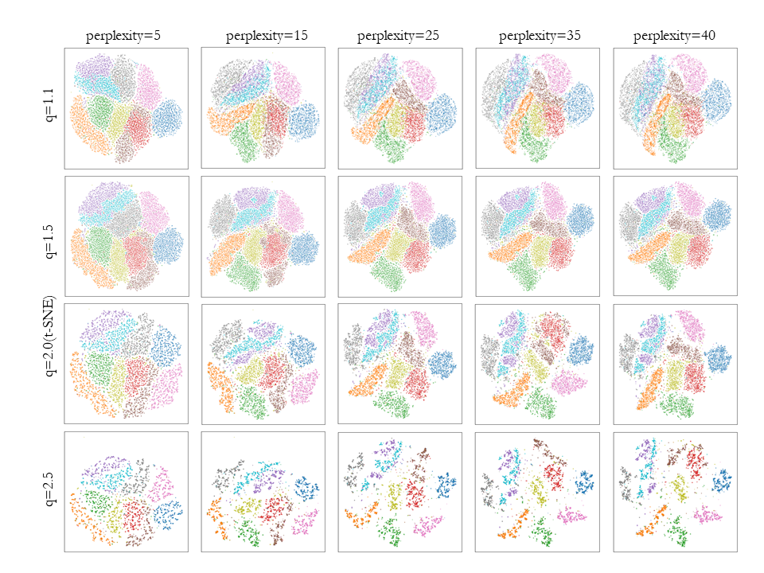

# Parametric q-SNE
We also developed parametric q-SNE [here](https://github.com/i13abe/parametric-qSNE/tree/main#parametric-q-sne).
Please see it.

# q-SNE
q-SNE: Visualizing Data using q-Gaussian Distributed Stochastic Neighbor Embedding

MNIST with several hyperparameter q in below.


COIL-20 with several hyperparameter q in below.


FashionMNIST with several hyperparameter q in below.


The q-SNE is a dimensionality reduction technique to improve t-SNE.
The q-SNE uses q-Gaussian distribution in low-dimensional space instead of t-distribution of t-SNE.
The q-Gaussian distribution is a probability distribution maximized the tsallis entropy under appropriate constraints.
It is generalization of Gaussian distribution with hyperparameter q.
It has Gaussian distribution when q close to 1, and t-distribution when q equal to 2.
The q-SNE shows visualization of 10,000 samples selected randomly on MNIST below.

<center></center>

The details for thw q-SNE can be found in 'https://arxiv.org/abs/2012.00999'.
This paper is accepted ICPR2020.

In this GitHub, we provide the implementation of q-SNE on Python.
Since we implemented q-SNE like a scikit-learn t-SNE, you can easily use it.

# Instllation
Requirements:
+ Python 3.6+
+ scikit-learn 0.23.2+
+ numpy 1.18+
+ scipy 1.5+
+ matplotlib 3.3+
+ gcc 7.5.0+ (to compile the cython file (.pyx))
+ OS Ubuntu 18.04.4

These requirments is just my development enviroment.

Please manual install to get this package:
```
git clone https://github.com/i13abe/q_SNE.git
```

Install the requirements:
```
sudo pip install -r requirements.txt
```

# How to use the q-SNE
We provide the test.ipynb to run demonstrate.
If you can use jupyter notebook or jupter lab, please use this demonstrate file.
If you can not use jupyter, please follow below step.

1. compile the "_util.pyx"
```
python setup.py build_ext --inplace
```

>If you have any error, maybe your gcc is wrong.
>When you can not compile "_util.pyx", please modify "_utils._binary_search_perplexity" at 126 line in "QSNE.py" to "_binary_search_perplexity".
>We prepare the "_binary_search_perplexity" function in "QSNE.py" for this wrong case (however it takes long time).

2. write the code to your python file
```
from QSNE import QSNE
import numpy as np
import matplotlib.pyplot as plt
from sklearn import datasets

digits = datasets.load_digits()

qsne = QSNE(n_components=2, q=2.0, verbose=1)
X_reduced = qsne.fit_transform(digits.data)

plt.scatter(X_reduced[:, 0], X_reduced[:, 1], c=digits.target)
plt.show()
```
The major parameters of q-SNE are as follows:
>+ n_components:The dimension of low-dimensional space (default: 2).
>+ q:The hyperparameter of q-Gaussian distribution (default: 2.0). When q=2.0, q-SNE becomes t-SNE because q-Gaussian distribution becomes t-distribution. When q close to 1 (q=1.001), q-SNE close to SNE.

Other parameters of q-SNE are same as t-SNE.
